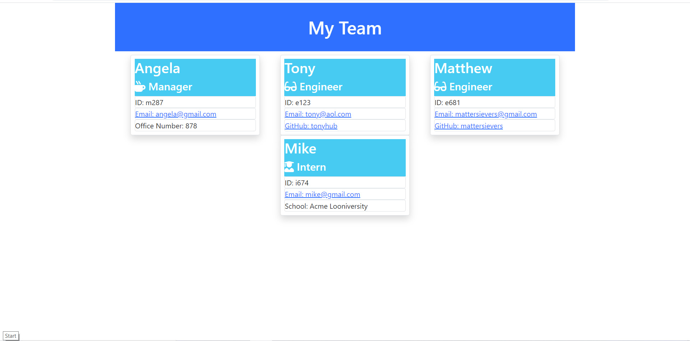

 
  # Employee Directory HTML Generator

  ## Table of Contents
  * [Description](#description)
  * [Information](#information)
  * [Install](#install)
  * [Use](#use)
  * [License](#license)
  * [Contributing](#contributing)
  * [Tests](#tests)
  * [Questions](#questions)
  

  ## Description
  This program takes in employee information for a specific manager and their team of engineers and interns. The program allows input of the manager's name, ID, email, and office number. It allows input of the engineer's name, id, email, and github username. It allows input of the intern's name, id, email, and school. The program returns an HTML template that allows the user to contact the employees through email or to visit github profiles where usernames are provided.

  ## Information
  This program uses node.js to generate an HTML and correlating style sheet with an employee directory.
  
  [Link to walk-through video](https://drive.google.com/file/d/1fJNfO4lAEGEOoQHwLY2RCMJ5fVS5ePqr/view?usp=sharing)

  ## Install
   Ensure you have the latest Node.js installed. Run the command "npm init" and "npm install inquirer" in the command line of your terminal to install the appropriate packages. Use the command "node index" to initialize the program.
  
  ## Use
  Use the command "node index" and follow the prompts to input information about the manager. The user will then be prompted whether they want to add an engineer, add an intern, or to finish the team. If the user chooses to add a member, they will be prompted to input information about the employee. After they have completed inputting information about the employee, they will receive a similar prompt to add or complete the team. When a user completes the team, an HTML file will be generated with accessible employee information.
  
  ## License
  No license.

  ## Contributing
  [](code_of_conduct.md)

  ## Tests
  Install jest with the command "npm install jest". In the package.json file make sure that under the script property, the test property is set to "jest" as follows:
  ```
  "scripts": {
    "test": "jest"
  },
  ```
  Run the command "npm test" to run the tests.
  
  ## Questions
  - [Github for mattersievers](http://www.github.com/mattersievers)
  - For further questions, contact me through email at mattersievers@gmail.com

 
